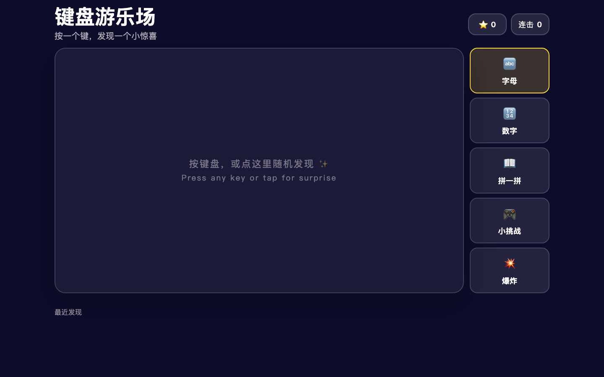

# Kids Keyboard Learning

一个面向小朋友的键盘学习游乐场。打开页面后，孩子可以通过按键、点击或触摸来探索字母、数字、拼音、中文词语、英文词语、声音和动画反馈。

在线访问：

[https://tokenfeed.cn/kids/](https://tokenfeed.cn/kids/)

## Screenshot



## Features

- 字母探索：按 `A-Z` 显示字母、emoji、中文、拼音和英文。
- 数字探索：按 `0-9` 显示数字、中文数字、计数动画和描边效果。
- 拼音发现：输入拼音后显示对应汉字和读音。
- 小挑战：根据提示按下正确字母，获得鼓励反馈。
- 轻量奖励：星星、连击和最近发现记录。
- 音效切换：爆炸、音符、小提琴三种反馈效果。
- 移动端支持：提供键盘唤起入口和响应式布局。

## Run Locally

这个项目是纯静态页面，不需要安装依赖。

```bash
python3 -m http.server 8081
```

然后打开：

```text
http://localhost:8081/
```

也可以直接用浏览器打开 `index.html`。

## Project Structure

```text
.
├── index.html
├── README.md
├── agent.md
├── assets/
│   └── screenshots/
│       └── playground.png
└── docs/
    └── superpowers/
```

## Verification

修改 `index.html` 后，可以先检查内联脚本语法：

```bash
node -e "const fs=require('fs');const s=fs.readFileSync('index.html','utf8');const m=s.match(/<script>([\s\S]*)<\/script>/);new Function(m[1]);console.log('script syntax ok')"
```

然后在 Chrome 中手动验证：

- 页面能正常打开。
- 按字母键会更新舞台和奖励。
- 按数字键会显示计数内容。
- 拼音、小挑战、音效切换可用。
- 窄屏下按钮和文字不重叠。

## Deployment

当前部署路径：

```text
/var/www/tokenfeed.cn/kids/index.html
```

Nginx 将 `/kids/` 映射到该目录，HTTPS 证书已配置在服务器上。
